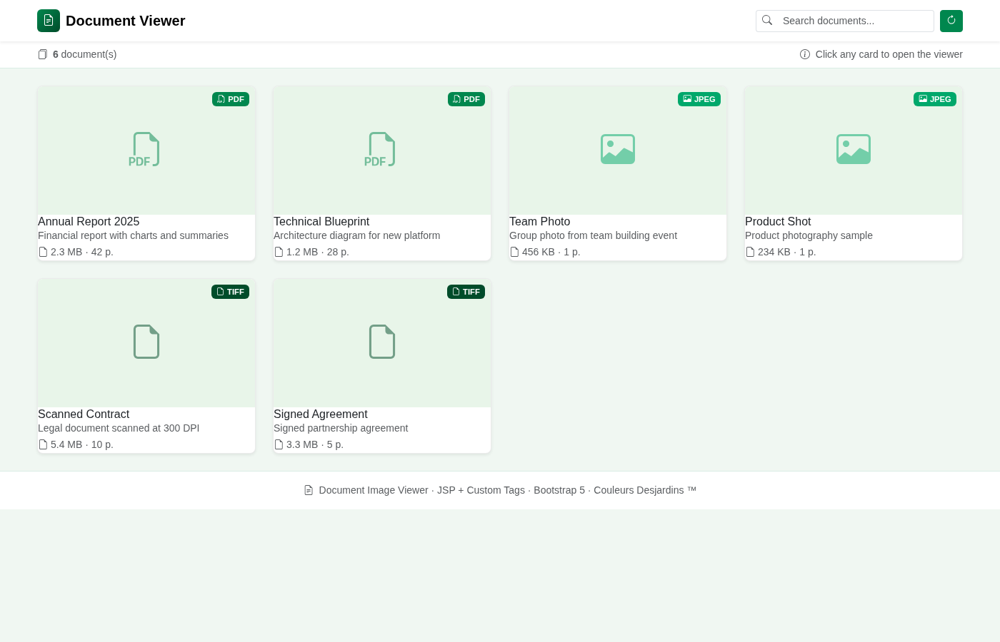
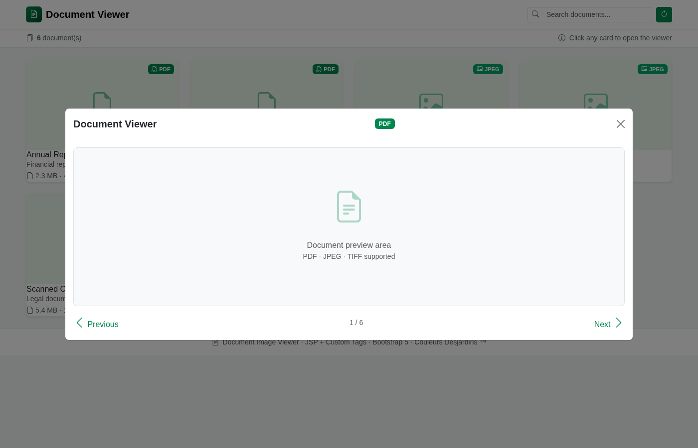

# Document Image Viewer

> JSP + Custom Tags | Desjardins Brand Colors | Multi-format document viewer

## Screenshots

### Document Grid

*Grid view showing 6 sample documents (PDF, JPEG, TIFF)*

### Document Viewer Modal

*Modal viewer with navigation between documents*

## Features
- **Multi-format support:** PDF, JPEG, TIFF documents
- **Custom JSP tags:** `<doc:documentViewer>` and `<doc:imageViewer>`
- **Navigation:** Previous/Next between documents in the viewer
- **Search:** Filter documents by name or type
- **Desjardins branding:** Official colors (#00874e teal)
- **Responsive:** Bootstrap 5 grid, works on all screen sizes
- **WireMock stubs:** Mock API for rapid prototyping

## Sample Documents
| File | Type | Description |
|------|------|-------------|
| `sample.pdf` | PDF | Annual Report 2025 |
| `blueprint.pdf` | PDF | Technical Blueprint |
| `photo.jpg` | JPEG | Team Photo |
| `sample.jpg` | JPEG | Product Shot |
| `scan.tiff` | TIFF | Scanned Contract |
| `document.tiff` | TIFF | Signed Agreement |

## Build & Deploy
```bash
mvn clean package
# Deploy WAR to Tomcat 10+
cp target/document-image-viewer.war /path/to/tomcat/webapps/
```

## Architecture
```
JSP Page → Custom Tags (Taglib) → WireMock Stubs → Local Files
   ↓                ↓                    ↓
index.jsp     docviewer.tld        documents.json → samples/*.{pdf,jpg,tiff}
```
